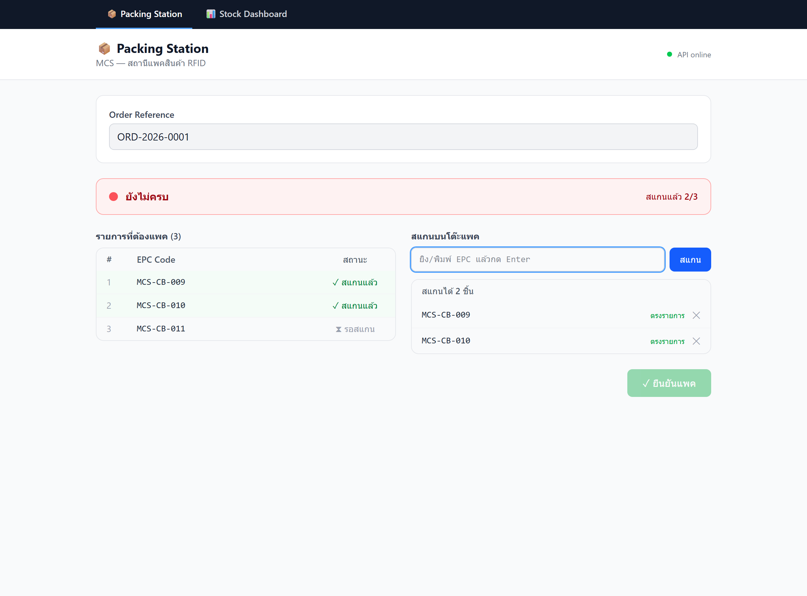
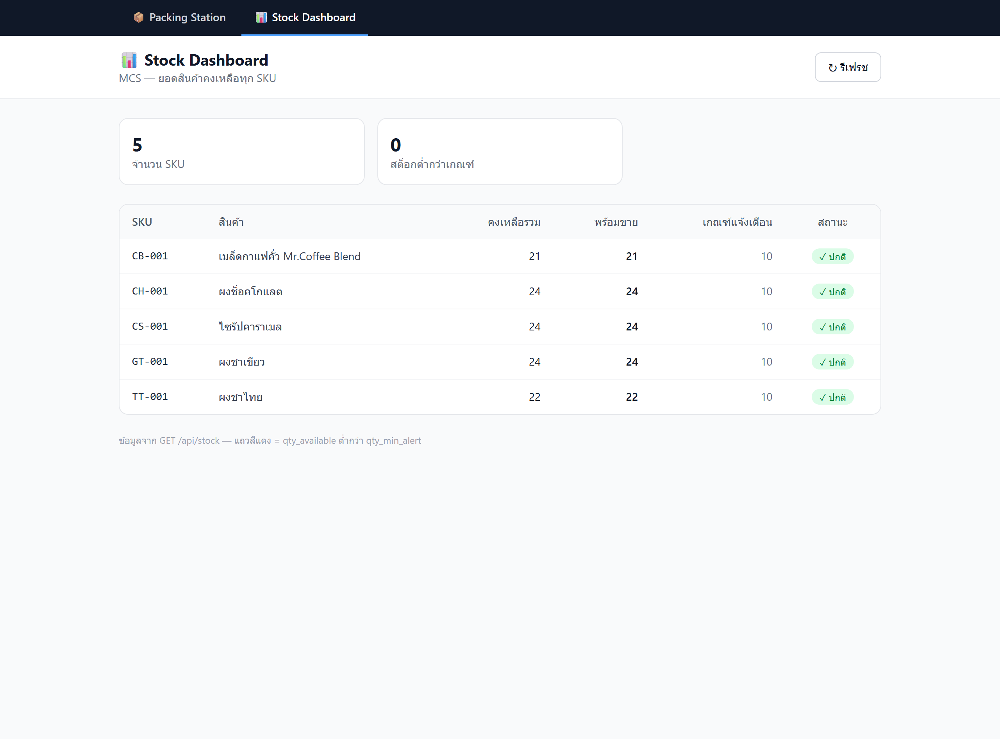

# mcs-backend

**MCS CRM Backend API + RFID Stock + Manufacturing** — ระบบหลังบ้านสำหรับคลังวัตถุดิบ สายการผลิต และสินค้าคงคลัง RFID
สร้างด้วย **Node.js + Express + PostgreSQL**

รองรับครบวงจร:
- **คลังวัตถุดิบ (Warehouse):** รับเข้า/จ่ายออกวัตถุดิบ + ตัดสต็อกอัตโนมัติผ่าน trigger
- **การผลิต (Production + BOM):** สูตรการผลิต → เปิดใบสั่งผลิต → จอง/ตัดวัตถุดิบ → บันทึกผลผลิต
- **RFID + Stock:** ลงทะเบียน tag, รับเข้าคลัง, สแกนขาย, ตัดสต็อกอัตโนมัติ
- **Packing:** เริ่ม → สแกนตรวจสอบ → ยืนยัน → ส่งออก

> Frontend ที่ใช้คู่กัน: [mcs-frontend](https://github.com/yootmcs/mcs-frontend)

---

## 📸 ตัวอย่างหน้าจอ (Frontend)

| Packing Station | Stock Dashboard |
| --- | --- |
|  |  |

---

## 1. โปรเจกต์นี้คืออะไร

Backend API สำหรับระบบ CRM + คลังสินค้า RFID ของ MCS ทำหน้าที่:
- จัดการสินค้า (products) และ RFID tags (EPC)
- ติดตามยอดคงเหลือ (stock levels) พร้อมแจ้งเตือนสต็อกต่ำ
- บันทึกการเคลื่อนไหวสต็อก (receive / sell / pack / return / adjust / count) โดย **trigger อัปเดตยอดคงเหลืออัตโนมัติ**
- flow การแพคสินค้า: เริ่ม → สแกนตรวจสอบ → ยืนยัน → ส่งออก

---

## 2. สิ่งที่ต้องติดตั้งก่อน (Prerequisites)

| เครื่องมือ | เวอร์ชันแนะนำ | ลิงก์ |
| --- | --- | --- |
| **Node.js** | LTS (18+ / ทดสอบบน v24) | https://nodejs.org |
| **PostgreSQL** | 17 | https://www.postgresql.org/download |
| **Git** | ล่าสุด | https://git-scm.com |

> Windows: หลังติดตั้ง PostgreSQL ควรเพิ่มโฟลเดอร์ `bin` เข้า PATH เพื่อใช้คำสั่ง `psql`
> เช่น `C:\Program Files\PostgreSQL\17\bin`

---

## 3. Clone โปรเจกต์

```bash
git clone https://github.com/yootmcs/mcs-backend.git
cd mcs-backend
```

---

## 4. ติดตั้ง dependencies

```bash
npm install
```

---

## 5. ตั้งค่า `.env`

คัดลอกไฟล์ตัวอย่างแล้วแก้รหัสผ่านฐานข้อมูลให้ตรงกับเครื่องคุณ

```bash
# macOS / Linux
cp .env.example .env

# Windows (PowerShell)
Copy-Item .env.example .env
```

แก้ค่าในไฟล์ `.env`:

```env
NODE_ENV=development
PORT=3000

DB_HOST=localhost
DB_PORT=5432
DB_NAME=mcs_backend
DB_USER=postgres
DB_PASSWORD=<ใส่รหัสผ่าน PostgreSQL ของคุณ>
DB_POOL_MAX=10
```

---

## 6. สร้างฐานข้อมูล `mcs_backend`

```bash
# ใช้ psql (จะถามรหัสผ่าน)
psql -U postgres -h localhost -c "CREATE DATABASE mcs_backend;"
```

ตรวจว่าเชื่อมต่อได้:

```bash
npm run db:test
```

---

## 7. รัน SQL Schema (สร้างตาราง + trigger)

รัน migration **ทั้งหมดตามลำดับ** (มีทั้ง RFID, Packing, Warehouse, BOM, Production):

```bash
node src/scripts/runSql.js src/scripts/001_create_rfid_schema.sql
node src/scripts/runSql.js src/scripts/003_add_packing_expected.sql
node src/scripts/runSql.js src/scripts/005_create_warehouse_schema.sql
node src/scripts/runSql.js src/scripts/007_create_bom_schema.sql
node src/scripts/runSql.js src/scripts/008_add_bom_output_material.sql
```

| Migration | สร้างอะไร |
| --- | --- |
| `001` | RFID/Stock: `products`, `rfid_tags`, `stock_levels`, `stock_transactions`, `packing_sessions` + trigger `trg_apply_stock_transaction` |
| `003` | เพิ่ม `expected_epc_codes` ให้ `packing_sessions` |
| `005` | Warehouse: `raw_materials`, `warehouse_stock`, `warehouse_receipts/_items`, `warehouse_issues/_items` + trigger รับเข้า/จ่ายออก |
| `007` | BOM: `bom_templates`, `bom_items`, `production_orders`, `production_outputs` (+ seed 2 สูตร) |
| `008` | เพิ่ม `output_material_id` ให้ BOM สาย roasting |

> **สำคัญ (Windows):** ใช้ `node src/scripts/runSql.js` แทน `psql -f` หรือ `Get-Content | psql`
> เพราะ PowerShell pipe จะแปลงภาษาไทยเป็น `?` ก่อนถึง Postgres ทำให้ข้อมูลเสีย

---

## 8. รัน Seed Data (ข้อมูลตัวอย่าง)

```bash
node src/scripts/runSql.js src/scripts/002_seed_data.sql
node src/scripts/runSql.js src/scripts/004_fix_thai_names.sql
node src/scripts/runSql.js src/scripts/006_seed_raw_materials.sql
```

ได้:
- 5 สินค้า (เมล็ดกาแฟ, ผงชาไทย, ไซรัปคาราเมล, ผงชาเขียว, ช็อคโกแลต) + 20 RFID tags (`MCS-CB-001` ถึง `MCS-CB-020`)
- **62 วัตถุดิบจริง** (เมล็ดกาแฟดิบ, ผง, ใบชา, ไซรัป, ครีม, บรรจุภัณฑ์) + เมล็ดคั่วกึ่งสำเร็จ = 63 รายการ
- 2 สูตร BOM (`BOM-001` คั่วกาแฟ, `BOM-002` แพคถุง 500g) — มากับ migration `007`

> ถ้าชื่อภาษาไทยแสดงเป็น `?` สาเหตุมาจากการรันผ่าน pipe — รันไฟล์ seed ซ้ำด้วย `node src/scripts/runSql.js` (UTF-8 safe)

---

## 9. รัน Dev Server

```bash
npm run dev        # auto-reload (node --watch)
# หรือ
npm start          # production
```

เซิร์ฟเวอร์รันที่ **http://localhost:3000**

---

## 10. API Endpoints

Base URL: `http://localhost:3000/api`

| Method | Path | คำอธิบาย |
| --- | --- | --- |
| GET | `/health` | เช็คว่า service ทำงาน |
| GET | `/health/db` | เช็คการเชื่อมต่อฐานข้อมูล |
| POST | `/rfid/tags` | ลงทะเบียน tag ใหม่ + รับเข้าคลัง (stock +) |
| POST | `/rfid/scan` | สแกน EPC → ขาย + อัปเดต status + แจ้งเตือน |
| GET | `/products` | ดูสินค้าทั้งหมด |
| POST | `/products` | เพิ่มสินค้าใหม่ |
| GET | `/products/:id` | ดูสินค้ารายชิ้น |
| GET | `/stock` | ยอดคงเหลือทุก SKU + แจ้งเตือนสต็อกต่ำ |
| POST | `/packing/start` | เริ่ม packing session (เก็บ EPC ที่ต้องแพค) |
| POST | `/packing/verify` | เทียบ scanned vs expected → ตัดสต็อก + tag = sold |
| POST | `/packing/ship` | ยืนยันส่งออก (packed → shipped) |
| GET | `/packing/:packing_id` | ดูสถานะ packing session |

**🏭 Warehouse (คลังวัตถุดิบ)**

| Method | Path | คำอธิบาย |
| --- | --- | --- |
| GET | `/warehouse/materials` | ดูวัตถุดิบทั้งหมด (กรอง `?category=BEAN\|POWDER\|LEAF\|SYRUP\|CREAM\|PKG`) |
| POST | `/warehouse/materials` | เพิ่มวัตถุดิบใหม่ |
| POST | `/warehouse/receipts` | รับวัตถุดิบเข้าคลัง (stock +) |
| GET | `/warehouse/receipts` `/:id` | ดูใบรับเข้า |
| POST | `/warehouse/issues` | จ่ายวัตถุดิบออก (stock −, กันติดลบ) |
| GET | `/warehouse/issues` `/:id` | ดูใบจ่ายออก |
| GET | `/warehouse/stock` | ยอดคงเหลือวัตถุดิบ + แจ้งเตือนต่ำ |

**⚙️ BOM + Production (สูตร + สายการผลิต)**

| Method | Path | คำอธิบาย |
| --- | --- | --- |
| GET/POST | `/bom` | ดู/สร้างสูตรการผลิต (roasting / packaging) |
| GET | `/bom/:id` | ดูสูตร + ส่วนผสม |
| POST | `/production/orders` | เปิดใบสั่งผลิต → เช็ค+จองวัตถุดิบ |
| GET | `/production/orders` `/:id` | ดูใบสั่งผลิต |
| POST | `/production/orders/:id/start` | เริ่มผลิต → ตัดวัตถุดิบจริง |
| POST | `/production/orders/:id/complete` | จบผลิต → บันทึกผลผลิต เข้าสต็อก |

ตัวอย่างเรียก:

```bash
curl http://localhost:3000/api/stock
curl http://localhost:3000/api/warehouse/stock
curl http://localhost:3000/api/bom
```

---

## 11. ทดสอบ End-to-End

รันสคริปต์ที่เดินไล่ทั้ง flow (ลงทะเบียน → รับเข้า → แพค → verify → ส่งออก) พร้อมตรวจสอบทุกขั้น:

```bash
# เปิดเซิร์ฟเวอร์ไว้ก่อน (npm run dev) แล้วอีก terminal รัน:
npm run demo:e2e
```

สคริปต์จะสร้างข้อมูลทดสอบ เดิน flow ครบ แล้วลบข้อมูลทิ้งอัตโนมัติ (ใช้ `--keep` เพื่อเก็บไว้ตรวจ)

---

## คำสั่งที่ใช้บ่อย

```bash
npm run dev        # เปิดเซิร์ฟเวอร์ (auto-reload)
npm start          # production
npm run db:test    # ทดสอบการเชื่อมต่อ DB
npm run rfid:sim   # จำลองเครื่องอ่าน RFID
npm run demo:e2e   # ทดสอบ flow ครบวงจร
```

## โครงสร้างโปรเจกต์

```
mcs-backend/
├── server.js                 # entry point + graceful shutdown
├── src/
│   ├── app.js                # Express app
│   ├── config/               # env config + PostgreSQL pool
│   ├── routes/               # health, rfid, products, stock, packing,
│   │                         #   warehouse, bom, production
│   ├── controllers/          # request handlers
│   ├── services/             # business logic (warehouse, bom/production)
│   ├── models/               # data access (warehouse, bom)
│   ├── middlewares/          # error handler, 404
│   ├── utils/                # handleDbError (pg error → HTTP)
│   └── scripts/              # SQL migrations (001–008), seed, runners, demo
```

## Stack

Node.js · Express · PostgreSQL (pg) · helmet · cors · morgan · dotenv

## License

เผยแพร่ภายใต้ [MIT License](LICENSE)
